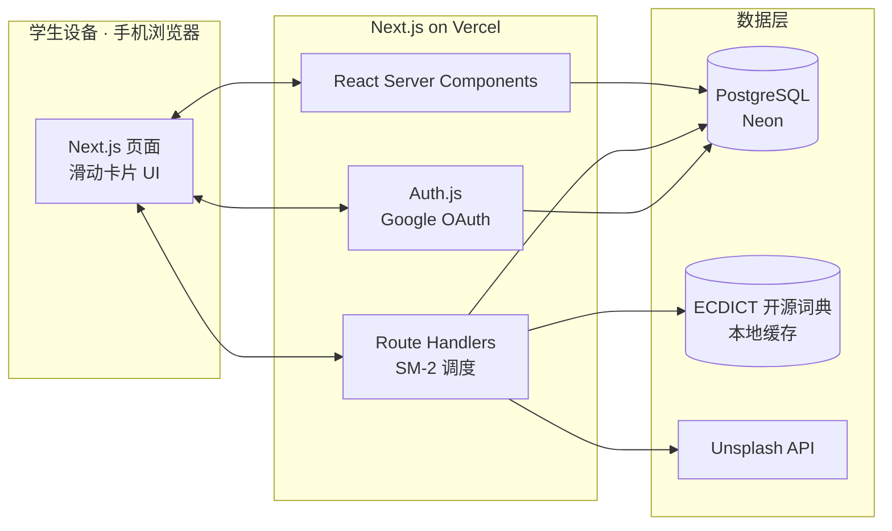

# 中学生英语单词认读学习平台 · 项目计划书

> 科创比赛参赛项目
> 版本：v0.2（根据科创方向重写）
> 创建日期：2026-07-19
> 状态：规划中

---

## 一、项目概述

### 1.1 项目背景

初中阶段英语词汇学习存在三个长期痛点：

1. **死记硬背效率低**：学生普遍采用"背单词表"方式，缺乏科学的复习节奏，遗忘率高。
2. **碎片时间难利用**：课间、通勤、排队等 1–10 分钟的碎片时间没有顺手的学习工具。
3. **现有工具不适配**：
   - **Anki**：算法严谨但 UI 陡峭，中学生上手难；
   - **百词斩**：图片记忆为主，但脱离图片后认读能力提升有限；
   - **教材配套 App**：封闭、不可跨教材、体验落后。

认知心理学与教育数据挖掘领域已有大量成熟研究（Ebbinghaus 遗忘曲线、SM-2、知识追踪），但**这些成果在国内中学生可用产品中的严谨落地仍然稀缺**。

### 1.2 项目目标

构建一个**面向中学生、移动优先**的英语单词**认读**学习网站：

- **核心目标**：认字——看到英文能迅速反应出中文含义（不含拼写/语法/听说）。
- **算法核心**：基于 **SM-2 间隔重复算法**，科学安排每个单词的复习时间。
- **体验核心**：随时随地、可随时中断、下次自动续学。
- **交互核心**：左滑"不会"→ 系统多模态教认字；右滑"会"→ 进入下一复习周期。

### 1.3 项目意义

- 把认知心理学（Ebbinghaus 1885）、优化学习（Wozniak 1994）、知识追踪（Corbett & Anderson 1995; Piech 2015; Settles 2016）等**严谨学术成果**落地到中学生真正可用的产品。
- 移动优先设计，贴合中学生碎片化学习场景，降低坚持学习的门槛。
- 所有记忆调度逻辑严格遵循公开论文，**可复现、可评估、可对比**，具备科研价值。

---

## 二、目标用户与使用场景

### 2.1 目标用户

- **主要用户**：初一至初三学生。
- **学习目标**：应对中考英语词汇（CEFR A1–B1，约 1600–2000 词）。

### 2.2 典型使用场景

- 课间、通勤、排队、睡前等碎片时间。
- 单次学习时长 **1–10 分钟**，随时可中断。
- 下次打开自动从上次位置继续，无需任何"恢复"操作。

### 2.3 典型用户故事

> 小明在公交车上打开网站。系统按 SM-2 算法推送「今日待复习 + 今日新词」。
>
> - 看到 `abandon`，他认识 → **向右滑** → 该词进入下一复习周期（间隔变长）。
> - 看到 `abundant`，他不认识 → **向左滑** → 系统展开「教认字」面板：音标、释义、例句、图片、近反义词。该词重置为**高频复习**。
>
> 5 分钟后到站，他关闭页面。下次打开，系统自动接着上次的进度继续。

---

## 三、核心功能（MVP）

| # | 功能 | 说明 |
|---|---|---|
| 1 | **Gmail 一键登录** | Auth.js + Google OAuth，同设备登录一次后长期免登 |
| 2 | **滑动卡片学习** | 左滑"不会" / 右滑"会"，触摸优先 |
| 3 | **SM-2 间隔重复调度** | 每词维护 ease factor / interval / repetitions / next review date |
| 4 | **多模态助记面板** | 左滑后展示音标、释义、例句、图片、近反义词 |
| 5 | **进度持久化** | 任意中断、任意设备登录后继续 |
| 6 | **分级词表浏览** | A1 / A2 / B1，按主题分类 |
| 7 | **学习统计** | 今日新学/复习数、连续打卡天数、总体掌握度 |

### 3.1 左滑后的「教认字」面板内容

- **音标 + TTS 发音**（浏览器内置 SpeechSynthesis，零成本）
- **中文释义**（按词性分条）
- **例句**（优先初高中难度）
- **助记图片**（视觉联想）
- **近义词 / 反义词**

---

## 四、技术方案

### 4.1 记忆算法 —— SM-2

#### 论文依据

- **理论基础**：
  - Ebbinghaus, H. (1885). *Memory: A contribution to experimental psychology*. —— 遗忘曲线奠基之作。
  - Cepeda, N. J., et al. (2008). *Spacing effects in learning: A temporal ridgeline of optimal retention*. **Psychological Science**. —— 综合 254 项实验，给出最佳复习间隔。
- **算法本体**：
  - Wozniak, P. (1994). *Optimization of learning: A new approach and computer application*. —— **SM-2 算法原始论文，Anki 即用其改进版**。
  - Leitner, S. (1972). *So lernt man lernen*. —— Leitner System，SM-2 的概念前身。

#### 为什么选 SM-2

| 候选 | 论文依据 | 实现难度 | 适合本项目？ |
|---|---|---|---|
| Leitner System | Leitner 1972 | 极低 | 创新性偏弱 |
| **SM-2** | **Wozniak 1994** | **低（公式现成）** | **✅ MVP 首选** |
| Half-Life Regression | Settles 2016 (Duolingo) | 中（需训练） | 未来工作 |
| BKT / DKT | Corbett 1995 / Piech 2015 | 高（概率图/神经网络） | 未来工作 |

#### 算法状态（每词一份）

```ts
interface ReviewState {
  easeFactor: number;      // 难度系数，初始 2.5
  interval: number;        // 当前间隔（天）
  repetitions: number;     // 连续答对次数
  nextReviewDate: Date;    // 下次到期日
  lastReviewedAt: Date | null;
}
```

#### 滑动操作 → SM-2 quality 评级

| 用户操作 | quality (0–5) | 含义 |
|---|---|---|
| 左滑「不会」 | 2 | 完全不认识（重置） |
| 右滑「会」 | 5 | 认识（正常推进） |

#### SM-2 更新公式（标准实现）

```ts
function updateSM2(state: ReviewState, quality: number): ReviewState {
  // quality: 0–5
  let { easeFactor, interval, repetitions } = state;

  if (quality < 3) {
    repetitions = 0;
    interval = 1;
  } else {
    if (repetitions === 0)      interval = 1;
    else if (repetitions === 1) interval = 6;
    else                        interval = Math.round(interval * easeFactor);
    repetitions += 1;
  }

  easeFactor = Math.max(
    1.3,
    easeFactor + (0.1 - (5 - quality) * (0.08 + (5 - quality) * 0.02))
  );

  const nextReviewDate = new Date();
  nextReviewDate.setDate(nextReviewDate.getDate() + interval);

  return { ...state, easeFactor, interval, repetitions, nextReviewDate,
           lastReviewedAt: new Date() };
}
```

### 4.2 技术栈

| 层 | 技术 | 说明 |
|---|---|---|
| 前端框架 | **Next.js 16**（App Router, Turbopack） | 已初始化 |
| UI | **React 19 + Tailwind CSS v4** | 移动优先 |
| 滑动交互 | `framer-motion` 或 `@use-gesture/react` | 触摸滑动卡片 |
| 数据库 | **PostgreSQL (Neon serverless)** | 已配置 |
| ORM | **Prisma 7 + `@prisma/adapter-pg`** | 已配置 |
| 认证 | **Auth.js (NextAuth) + Google Provider** | Gmail 登录，JWT cookie 长期持久 |
| 部署 | **Vercel** | Next.js 官方平台，免费额度够用 |

### 4.3 系统架构



### 4.4 数据模型（Prisma）

```prisma
// 用户：Auth.js 标准 model
model User {
  id            String    @id @default(cuid())
  email         String    @unique
  name          String?
  image         String?
  emailVerified DateTime?
  createdAt     DateTime  @default(now())
  reviews       Review[]
  accounts      Account[]
  sessions      Session[]
}

// 单词：来自 ECDICT + word list.md
model Word {
  id         String   @id @default(cuid())
  term       String   @unique           // 英文
  phonetic   String?                    // 音标
  pos        String?                    // 词性
  definition String                     // 中文释义
  level      Level                       // A1 / A2 / B1
  category   String?                    // 主题（Family / Colors ...）
  examples   Json?                      // 例句数组
  synonyms   String[]                   // 近义词
  antonyms   String[]                   // 反义词
  imageUrl   String?                    // 助记图（Unsplash）
  reviews    Review[]

  @@index([level])
  @@index([category])
}

// 学习记录：每用户每词一份 SM-2 状态
model Review {
  id             String   @id @default(cuid())
  userId         String
  wordId         String
  easeFactor     Float    @default(2.5)
  interval       Int      @default(0)
  repetitions    Int      @default(0)
  nextReviewDate DateTime
  lastReviewedAt DateTime?
  totalReviews   Int      @default(0)
  user           User     @relation(fields: [userId], references: [id], onDelete: Cascade)
  word           Word     @relation(fields: [wordId], references: [id], onDelete: Cascade)

  @@unique([userId, wordId])
  @@index([userId, nextReviewDate])
}

enum Level {
  A1
  A2
  B1
}
```

### 4.5 助记素材来源

| 素材 | 来源 | 说明 |
|---|---|---|
| 释义 / 音标 / 词性 | **ECDICT**（`skywind3000/ECDICT`） | GitHub 开源英汉词典，77 万词条，带 `tag` 字段标注难度（cet4/cet6/ky/gaozhong...） |
| 例句 | ECDICT 内置例句字段 + Free Dictionary API 补充 | 优先选初高中难度 |
| 近义词 / 反义词 | ECDICT `exchange` 字段 | 已结构化解析 |
| 助记图片 | **Unsplash API**（免费） | 按 term 关键词检索 |
| 发音 | 浏览器 `SpeechSynthesis` API | 零成本，无需音频文件 |

> **ECDICT 难度筛选**：用 `tag` 字段过滤出 `gaozhong`(高中) / `cet4`(四级，≈高考难度)，对应本项目 A1–B1 范围。

---

## 五、创新点

1. **SM-2 严谨落地中学词汇场景**
   多数国内产品采用自研启发式调度，本项目严格实现 Wozniak (1994) 的 SM-2，参数与公式完全公开，**可复现、可对比、可评估**。

2. **滑动 + 多模态「教认字」面板**
   左滑触发"教"而非"罚"——系统主动提供例句/图片/近反义词帮助认读，区别于传统"答错就重背"的负反馈循环，更贴合**认读**这一具体目标。

3. **移动优先 + 零摩擦续学**
   单次学习无最小时长限制，任意点退出都自动保存进度；Gmail 登录一次，同设备长期免登。**把"坚持"的门槛降到最低**。

4. **学术依据扎实**
   每个核心设计决策都可追溯到认知心理学/EDM 经典文献（见第八节参考文献），满足科创项目对**严谨性**的要求。

---

## 六、与现有方案对比

| 工具 | 算法 | 中学生适配 | 移动体验 | 多模态助记 | 中考词表 |
|---|---|---|---|---|---|
| Anki | SM-2 | 弱（UI 陡） | 一般 | 需自制 | 需自制 |
| 百词斩 | 图片记忆启发式 | 中 | 好 | 强（图片主导） | 有 |
| 扇贝单词 | 自研 | 中 | 好 | 中 | 有 |
| 墨墨背单词 | 自研 | 中 | 好 | 中 | 有 |
| **本项目** | **SM-2（公开可复现）** | **强** | **强（滑动优先）** | **强（左滑多模态）** | **强（A1–B1 精选）** |

---

## 七、开发计划（里程碑）

| 阶段 | 内容 | 产出 | 预估工期 |
|---|---|---|---|
| **P0 资料整理** | 从 ECDICT 导出 A1–B1 词表；整理 `word list.md` 主题分类 | seed 脚本 + 词表 CSV | 1 周 |
| **P1 数据层** | Prisma schema 定稿、迁移、seed 入库 | 可查询的 Word 表 | 3 天 |
| **P2 认证** | Auth.js + Google Provider，JWT 长期持久 | 可登录网站 | 2 天 |
| **P3 学习核心** | 滑动卡片 UI + SM-2 调度 + 助记面板 | MVP 可用 | 1 周 |
| **P4 续学** | 进度持久化、"下次继续"逻辑 | 中断恢复 | 2 天 |
| **P5 统计** | 今日新学/复习、连续打卡、掌握度仪表盘 | 学习数据页 | 3 天 |
| **P6 移动打磨 + 部署** | 移动端 UI/UX 打磨、PWA、部署到 Vercel | 公测可用 | 1 周 |

---

## 八、参考文献

1. Ebbinghaus, H. (1885). *Memory: A contribution to experimental psychology*. New York: Teachers College, Columbia University.
2. Leitner, S. (1972). *So lernt man lernen: Der Weg zum Erfolg*. Freiburg: Herder.
3. Wozniak, P. (1994). *Optimization of learning: A new approach and computer application*. University of Technology in Poznan. **(SM-2 原始论文)**
4. Cepeda, N. J., Pashler, H., Vul, E., Wixted, J. T., & Rohrer, D. (2008). *Spacing effects in learning: A temporal ridgeline of optimal retention*. **Psychological Science**, 19(11), 1095–1102.
5. Corbett, A. T., & Anderson, J. R. (1995). *Knowledge tracing: Modeling the acquisition of procedural knowledge*. **User Modeling and User-Adapted Interaction**, 4(4), 253–268.
6. Piech, C., Bassen, J., Huang, J., Ganguli, S., Sahami, M., Guibas, L. J., & Sohl-Dickstein, J. (2015). *Deep knowledge tracing*. **Advances in Neural Information Processing Systems (NeurIPS)**, 28.
7. Settles, B., & Meeder, B. (2016). *A trainable spaced repetition model for language learning*. **Proceedings of ACL 2016**, 1848–1858. **(Duolingo Half-Life Regression)**

---

## 九、未来工作（比赛论文中的创新展望）

1. **Half-Life Regression（Settles 2016）**
   收集足够真实答题数据后，训练 HLR 模型替代 SM-2 的固定公式，实现更精准的个性化间隔预测。

2. **Bayesian / Deep Knowledge Tracing**
   引入 BKT（Corbett 1995）或 DKT（Piech 2015），建模"学习者已掌握该词"的概率分布，从"调度复习"升级为"掌握度诊断 + 个性化推荐"。

3. **扩展学习模式**
   - 听写模式（TTS → 学生输入）
   - 拼写模式（看中文 → 学生输入）
   - 当前 MVP 聚焦**认读**，其他模式作为路线图。

4. **教师/班级后台**
   支持教师查看班级整体掌握情况，布置周任务，让产品进入课堂场景。

---

## 附录 A：当前项目状态

- ✅ Next.js 16 + React 19 + Tailwind v4 脚手架已就绪
- ✅ Prisma 7 + adapter-pg 配置正确（符合 Prisma 7 driver adapter 规范）
- ✅ PostgreSQL（Neon）连接配置就绪
- ✅ `word list.md` 已有 A1 级别主题分类词表（约 20 主题）
- ⏳ Prisma schema 仍为默认 User 示例，待按本计划书第四章定稿
- ⏳ 业务页面、认证、SM-2 逻辑均未开始
