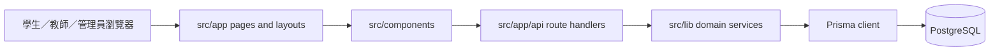

# English 架構導覽

> 文件角色：幫學生快速找到實作入口；細節以程式、測試及 schema 為準。

## 請先看這張資料流

頁面負責組裝及權限邊界，元件負責互動，route handler 負責 HTTP 輸入／輸出，domain service
負責政策、查詢及寫入。不要把 server scoring、授權或資料一致性搬到 client。

## 主要目錄

| 目錄 | 責任 | 常用入口 |
|---|---|---|
| `src/app/` | App Router pages、layouts、route handlers | `src/app/(student)/study/page.tsx`、`src/app/api/` |
| `src/components/` | 共用 shell、卡片、工作區及互動 UI | `WordCard.tsx`、`study-stream/StudyStreamV2.tsx` |
| `src/lib/learning-policy/` | level、scheduler、admission、quality 及狀態模型 | `scheduler.ts`、`admission.ts`、`quality.ts` |
| `src/lib/study-stream/` | V2 stream、credential、outbox、checkpoint、observability | `server.ts`、`contracts.ts`、`outbox.ts` |
| `src/lib/catalog/` | CSV、sense identity、治理、審核、歷史及 teacher presentation | `seed.ts`、`runtime.ts`、`submission-server.ts` |
| `src/lib/` | 認證、名冊、analytics、reward、leaderboard、日期及 HTTP helpers | 以領域檔案名稱搜尋 |
| `prisma/` | schema、seed、一般 migrations 及 contract migrations | `schema.prisma`、`seed.ts` |
| `tests/e2e/` | Playwright 學習、手勢、角色、locale、工作區及視覺驗收 | 按 `package.json` project script 執行 |
| `scripts/` | migration、DB checker、seed fixture、demo 及資料治理工具 | `DEMO-SCHOOL.md` 及腳本名稱 |
| `plans/` | 規範、實施計劃及有日期的證據 | `plans/README.md` |

## V2 學習邊界

現行 V2 action 的 transaction ownership 在 `src/lib/study-stream/server.ts`：先鎖定帳戶，
再做 receipt preflight，載入 item，最後在同一 Serializable transaction 處理 REVEAL、SELF_RATING、
OBJECTIVE_ANSWER 或 FEEDBACK_ACK。衝突只按 allowlist 重試；不可把四種 action 拆成互相獨立提交的 service。

client 可以保存 checkpoint／outbox，但 server 才擁有 item credential、nonce、question snapshot、
correctness、quality、receipt、Review revision 及 evidence provenance。self-rating 是 operational encounter，
只有 Objective Probe first response 形成 scored ReviewEvent。

## 角色及資料邊界

- 受保護 route 使用 `src/lib/session.ts` 的授權 helper；UI 可見與否不等於 API 授權。
- catalog 的 ACTIVE／DRAFT／RETIRED、approved revision、reviewer lock 及 revision CAS 由 catalog service 決定。
- analytics／reward 是不同 projection；歷史 reward policy 的固定版本不能被新 learning policy 靜默改寫。
- 日期及打卡使用 `Asia/Shanghai` 本地日曆日；不可直接用 UTC 日期替代。
- migration 只透過 `MIGRATE_URL` 及受控 migration 指令，禁止 `prisma db push` 取代歷史。

## V1 退役邊界

整頓目標只保留 V2。現有 assignment 分流、舊 client、舊 queue／checkpoint 及 compatibility inventory
仍在程式內，P4 會逐項分類。退役前不可刪除名字含 `v1` 的所有內容：`retrieval-v1`、歷史 event／receipt、
V2 的 legacy-data reader 及必要的 identity／provenance 欄位可能仍然有效。

完成退役後，本頁要更新為「新入口直接使用 V2、舊 writer 明確拒絕、歷史資料只讀解讀」，並保留實際驗收證據。
