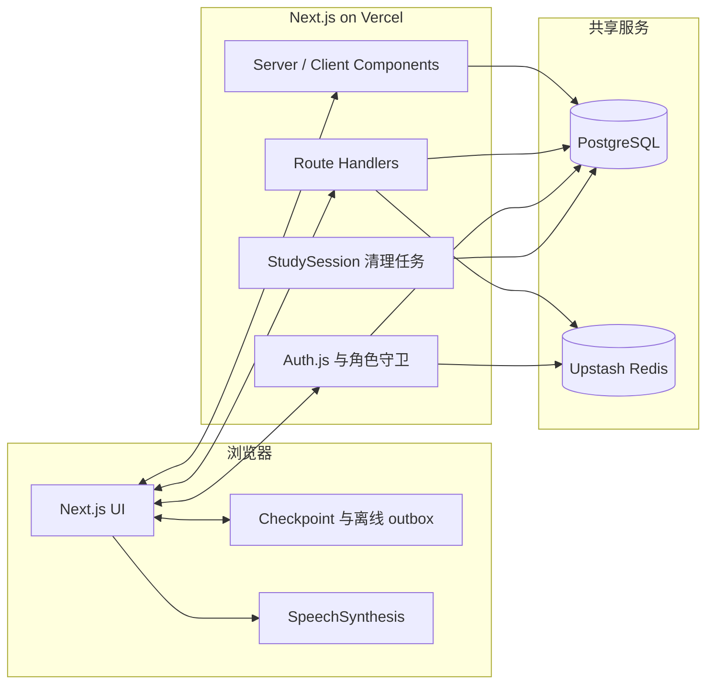

# 中学生英语单词认读学习平台 · 项目计划与现状

> 科创比赛参赛项目
> 版本：v0.4（Retrieval-first V2 local product baseline）
> 创建日期：2026-07-19
> 更新日期：2026-08-15
> 状态：Retrieval-first V2 本地产品基线已完成；production／pilot／research deferred

> 計劃書索引見 `plans/README.md`。本文內的程式及文件路徑均相對 repository root。

> 本文同时记录产品愿景、已实现能力和后续路线。代码行为以测试与
> `prisma/schema.prisma` 为准；生产部署流程以 `DEPLOY.md` 为准。
> 当前学生流程及 AI 交接快照见
> [Retrieval-first V2 Current Product Baseline](./artifacts/retrieval-first-v2-current-product-baseline.md)。

---

## 一、项目概述

### 1.1 项目背景

初中阶段英语词汇学习存在三个长期痛点：

1. **死记硬背效率低**：学生普遍采用"背单词表"方式，缺乏科学的复习节奏，遗忘率高。
2. **碎片时间难利用**：课间、通勤、排队等 1–10 分钟的碎片时间没有顺手的学习工具。
3. **学校场景仍有专门需求**：通用卡片工具自由度高，消费级背词产品内容丰富，
   但本项目要验证的是另一组约束——学校统一账号、教师可见进度、透明算法、
   可审计事件，以及学生无需自行配置的 Retrieval-first 认读流程。竞品公开能力见第六节。

认知心理学与教育数据挖掘领域已有大量成熟研究（Ebbinghaus 遗忘曲线、SM-2、知识追踪），但**这些成果在国内中学生可用产品中的严谨落地仍然稀缺**。

### 1.2 项目目标

构建一个**面向中学生、移动优先**的英语单词**认读**学习网站：

- **核心目标**：认字——看到英文能迅速反应出中文含义（不含拼写/语法/听说）。
- **算法核心**：基于 **SM-2 间隔重复算法**，科学安排每个单词的复习时间。
- **体验核心**：随时随地、可随时中断、下次自动续学。
- **学习核心**：先让学生尝试从记忆提取词义，再揭示答案；self-rating 与客观认读证据分开。
- **交互核心**：Learning Card 需在非发音区域原地长按 3 秒揭示，揭示后报告与刚才所想
  是否一致；Objective Probe 的第一次合法答案才由服务器判分并推动间隔状态。

### 1.3 项目意义

- 先把认知心理学与 SM-2 间隔重复实现成可运行、可测试的基线，再以真实学习事件
  评估 HLR、FSRS 或知识追踪等后续模型。
- 移动优先设计，贴合中学生碎片化学习场景，降低坚持学习的门槛。
- 所有记忆调度逻辑严格遵循公开论文，**可复现、可评估、可对比**，具备科研价值。

---

## 二、目标用户与使用场景

### 2.1 目标用户

- **主要用户**：初一至初三学生。
- **核心学习目标**：应对中考英语认读，以 A1–B1 为核心范围。
- **当前内容范围**：仓库词表和产品级别已扩展至 A1–B2、5000+ 去重词条；B2
  属扩展内容，不应与“中考核心词汇数量”混为一谈。

### 2.2 典型使用场景

- 课间、通勤、排队、睡前等碎片时间。
- 单次学习时长 **1–10 分钟**，随时可中断。
- 下次打开自动从上次位置继续，无需任何"恢复"操作。

### 2.3 典型用户故事

> 小明在公交车上打开网站。系统从 continuous stream 发出当前最合适的 Learning Card
> 或 Objective Probe，不要求完成固定题数。
>
> - 看到 `abandon`，他先在心里想中文意思；约一秒后出现长按提示。他在非发音区域
>   原地长按三秒，卡片翻转并显示中文意思、音标位及发音，然后报告答案与刚才所想
>   是否一致。这个报告只用于记录学习过程，不直接改变掌握度。
> - 稍后系统发出 Objective Probe；他第一次选择答案后由服务器判分。答对／答错分别
>   按 versioned policy 映射为 SM-2 quality 4／2，决定后续复习间隔。
>
> 5 分钟后到站，他关闭页面。下次打开，系统自动接着上次的进度继续。

---

## 三、核心功能与实现状态

| # | 功能 | 当前状态 | 说明 |
|---|---|---|---|
| 1 | **统一发放学生账号** | ✅ 已实现 | Seed 可选择建立独立临时密码的学生账号；首次登录强制改密，JWT 会话最长 30 天 |
| 2 | **Retrieval-first Learning Card** | ✅ 已实现 | 持续思考提示、延迟长按提示、3 秒 stationary long-press、揭示／翻卡及揭示后“一样／不一样”self-rating |
| 3 | **Objective Probe + SM-2 调度** | ✅ 已实现 | 首次客观认读答案由服务器判分，`retrieval-v1` 以 correct=4／wrong=2 推进 Review；self-rating 不直接评分 |
| 4 | **助记面板** | ⚠️ UI 已实现，内容待充实 | 支持音标、释义、例句、图片及近反义词，但默认 seed 目前主要导入单词、释义、级别和分类 |
| 5 | **进度持久化与续学** | ✅ 已实现 | Continuous stream、Checkpoint、离线 outbox、stream-item credential、operationId 幂等、session／lease bounded recovery |
| 6 | **分级与单元闯关** | ✅ 已实现 | A1 / A2 / B1 / B2；按主题分类，达到 80% 认字率后顺序解锁 |
| 7 | **学习统计与留存** | ✅ 已实现 | 已解锁范围进度、A1–B2 明细、7 日柱状图／30 日热力图、连续打卡、成就及排行榜 |
| 8 | **教师端** | ✅ 已实现核心能力 | 班级概览、学生分级进度与密码重置；尚未提供任务布置 |
| 9 | **管理端** | ✅ 已实现 | 用户、角色、单词库及系统统计管理，并保护最后一名管理员 |
| 10 | **安全与审计** | ✅ 已实现 | Upstash 分布式限流、session 撤销、审计哈希、ReviewEvent ledger 与生产配置门禁 |
| 11 | **简繁与主题** | ✅ 已实现 | opencc-js 简繁切换及明暗主题 |
| 12 | **PWA** | ⏳ 未实现 | 尚无 web app manifest、service worker 或安装流程 |
| 13 | **班級與名冊管理** | 🟡 進行中／Phase 8 local verification | Revision 3 已獲兩個相同全範圍 reviewer PASS；local implementation、43 個 normal forward migrations、guarded reset、roster/auth/invariant suites、4-test disposable admin workflow（含 explicit rollover dispositions）、500-row import／promotion boundary、5,000-row export／activation performance 及 5,001 caps 已驗證；contract migration、production-only positive config 及完整原生 screen-reader／device matrix deferred |

### 3.1 Learning Card 揭示后的内容

- **音标 + TTS 发音**（浏览器内置 SpeechSynthesis，零成本）
- **中文释义**（按词性分条）
- **例句**（优先初高中难度）
- **助记图片**（视觉联想）
- **近义词 / 反义词**

> 当前数据边界：组件和数据库字段已支持上述内容，但 `prisma/seed.ts` 只从
> `word list.md` 自动导入 term、definition、level 与 category；音标、例句、图片、
> 近义词和反义词需要经管理端或后续内容管线补充。因此“答案面已实现”不等于
> “全部 5000+ 词均已有完整多模态素材”。

---

## 四、技术方案

### 4.1 记忆算法 —— SM-2

#### 论文依据

- **理论基础**：
  - Ebbinghaus, H. (1885). *Memory: A contribution to experimental psychology*. —— 遗忘曲线奠基之作。
  - Cepeda, N. J., et al. (2008). *Spacing effects in learning: A temporal ridgeline of optimal retention*. **Psychological Science**. —— 综合 254 项实验，给出最佳复习间隔。
- **算法本体**：
  - Wozniak, P. (1994). *Optimization of learning: A new approach and computer application*. —— **SM-2 算法原始论文**。
  - Leitner, S. (1972). *So lernt man lernen*. —— Leitner System，SM-2 的概念前身。

> 截至 2026-08-10，[Anki 官方文档](https://docs.ankiweb.net/deck-options.html#fsrs)
> 已把 FSRS 作为现代调度方案，并将 SM-2 称为 legacy algorithm。因此本项目选择
> SM-2 的理由应是实现透明、容易复现、适合 MVP 与研究基线，而不是
> “Anki 当前也使用 SM-2”。

#### 为什么选 SM-2

| 候选 | 论文依据 | 实现难度 | 适合本项目？ |
|---|---|---|---|
| Leitner System | Leitner 1972 | 极低 | 创新性偏弱 |
| **SM-2** | **Wozniak 1994** | **低（公式现成）** | **✅ 当前可解释基线** |
| FSRS | 开源可训练调度器 | 中 | 收集足够复习数据后评估 |
| Half-Life Regression | Settles 2016 (Duolingo) | 中（需训练） | 未来工作 |
| BKT / DKT | Corbett 1995 / Piech 2015 | 高（概率图/神经网络） | 未来工作 |

#### 算法状态（每词一份）

```ts
interface ReviewState {
  easeFactor: number;      // 难度系数，初始 2.5
  interval: number;        // 当前间隔（天）
  repetitions: number;     // 连续答对次数
  nextReviewDate: Date;    // 下次到期日
  lastReviewedAt: Date | null;
}
```

#### V2 学习证据 → SM-2 quality 评级

| 事件 | 是否 scored | quality (0–5) | 含义 |
|---|---:|---:|---|
| Learning Card 揭示后的“一样／不一样”self-rating | 否 | 不适用 | 只记录 operational encounter，不直接改变 Review／mastery |
| Objective Probe 第一次合法答案正确 | 是 | 4 | 客观认读成功，正常推进间隔 |
| Objective Probe 第一次合法答案错误 | 是 | 2 | 客观认读失败，重置为短间隔并安排 remediation |
| Research-only diagnostic | 否 | 不适用 | 研究功能关闭；即使日后获批亦无 operational 副作用 |

quality mapping 属于 versioned `retrieval-v1` learning policy，不是永久不可改变的教育结论。
客户端不能提交可信 quality、correctness 或正确答案；服务器按 immutable question snapshot 判分。

#### SM-2 更新公式（标准实现）

```ts
function updateSM2(state: ReviewState, quality: number): ReviewState {
  // quality: 0–5
  let { easeFactor, interval, repetitions } = state;

  if (quality < 3) {
    repetitions = 0;
    interval = 1;
  } else {
    if (repetitions === 0)      interval = 1;
    else if (repetitions === 1) interval = 6;
    else                        interval = Math.round(interval * easeFactor);
    repetitions += 1;
  }

  easeFactor = Math.max(
    1.3,
    easeFactor + (0.1 - (5 - quality) * (0.08 + (5 - quality) * 0.02))
  );

  const nextReviewDate = new Date();
  nextReviewDate.setDate(nextReviewDate.getDate() + interval);

  return { ...state, easeFactor, interval, repetitions, nextReviewDate,
           lastReviewedAt: new Date() };
}
```

### 4.2 技术栈

| 层 | 技术 | 说明 |
|---|---|---|
| 前端框架 | **Next.js 16.2 + React 19.2** | App Router、Route Handlers、Server / Client Components |
| UI | **Tailwind CSS v4 + Framer Motion 12** | 移动优先；Framer Motion 已成为字卡手势的确定方案 |
| 数据库 | **PostgreSQL** | 本地 Docker 与托管 PostgreSQL 使用同一套 schema |
| ORM | **Prisma 7 + `@prisma/adapter-pg`** | 生成 Client 至 `src/generated/prisma`，runtime 使用 `pg` pool |
| 认证 | **Auth.js v4 Credentials Provider** | 账号密码、JWT、角色守卫、首次改密及 tokenVersion 撤销 |
| 分布式限流 | **Upstash Redis** | Production 必填；涵盖登录、学习队列、提交及凭证轮换 |
| 本地持久化 | **浏览器储存** | Checkpoint 和离线评测 outbox；恢复时仍由服务端重新授权 |
| 测试 | **Node test + Playwright** | Pure policy／DB integration／migration／Chromium／Firefox／WebKit／mobile emulation；实际数量以当前 test output 与计划 evidence 为准 |
| 部署 | **GitHub Actions + Vercel** | 先验证与迁移数据库，再部署同一 commit；是否已正式上线须由部署记录确认 |

### 4.3 系统架构



当前 runtime 不会查询 ECDICT、Free Dictionary API 或 Unsplash。词表内容由 seed
预先写入 PostgreSQL，应用请求只访问本项目数据库和限流服务。

### 4.4 数据模型（Prisma）

为避免计划书中的复制版 schema 再次落后，完整字段只在
`prisma/schema.prisma` 维护。当前模型职责如下：

| 模型 | 职责 |
|---|---|
| `User` | 账号、bcrypt 密码、角色、tokenVersion、首次改密状态及各类关联 |
| `Word` | 单词、释义、A1–B2 级别、分类及可选助记素材 |
| `Review` | 每位用户每个单词的当前 SM-2 状态 |
| `ReviewEvent` | V1／V2 scored ledger、词条快照、event kind、objective provenance 及成就解锁结果 |
| `StudySession` | 服务端签发的 V1／V2 flow-pinned session、到期时间、退休状态及原子轮换键 |
| `StudySessionItem` | 保留作 V1 compatibility／rollback 的 legacy 逐词 nonce item |
| `StudyStreamItem` | V2 canonical stream item、typed action、lease、credential digest lineage 及完成状态 |
| `EvidenceObligation` | 有上限／期限的日后 objective verification 工作 |
| `ObjectiveEvidenceTarget` | 单一 scored evidence target、expected Review revision 及 authoritative result |
| `ObjectiveQuestionSnapshot` | Immutable option／answer snapshot，供 server scoring、retry 及 dispute audit |
| `StudyEncounter` | Learning Card reveal／self-rating 等 operational encounter 记录 |
| `OperationReceipt` | 全局 `(userId, operationId)` 幂等结果及 authoritative response |
| `SecurityEvent` | 密码、角色、用户及 session 撤销等安全审计事件 |
| `DatabaseMetadata` | 数据库环境分类及 seed 安全标记 |
| `StudyDay` | 以 Asia/Shanghai 日历日记录的幂等打卡 |
| `UserAchievement` | 用户已解锁的成就 key 与时间 |

枚举包括 `Level`（A1 / A2 / B1 / B2）、`Role`（STUDENT / TEACHER /
ADMIN）、`ReviewEventKind` 与 `SecurityEventType`。

### 4.5 助记素材来源

| 素材 | 当前来源 | 当前状态 |
|---|---|---|
| 单词、中文释义、级别、主题 | 仓库内 `word list.md` | Seed 已自动解析；同词重复时保留最低级别 |
| 音标、词性 | 管理端 / 后续内容管线 | Schema 与 UI 支持，seed 未自动填充 |
| 例句 | 管理端 / 后续内容管线 | Schema 与 UI 支持，当前没有 Free Dictionary runtime 调用 |
| 近义词 / 反义词 | 管理端 / 后续内容管线 | 新词 seed 时写入空数组 |
| 助记图片 | 管理端填写 URL / 后续内容管线 | 当前没有 Unsplash runtime 调用 |
| 发音 | 浏览器 `SpeechSynthesis` API | 零成本，无需音频文件 |

ECDICT、受许可词典或图片服务仍可作为未来的离线内容构建来源，但必须先处理授权、
字段映射、内容审核与可重复构建；不能在本文中写成已经存在的线上依赖。

### 4.6 迁移历史与正确指令

#### 当前迁移历史

| 范围 | 数量 | 作用 |
|---|---:|---|
| 2026-07-24 至 2026-07-28 | 5 | 初始模型、角色、tokenVersion、首次改密及 B2；`add_user_role` 保留为历史 NO-OP |
| 2026-08-02 | 2 | StudyDay 与 UserAchievement |
| 2026-08-08 | 6 | ReviewEvent ledger、审计快照、事件种类、提交 session 与 legacy normalization |
| 2026-08-09 | 4 | StudySession / security 加固、管理员与学习 provenance、审计 subject 重建与清理 |
| 2026-08-10 | 1 | StudySession 原子 rotation |
| 2026-08-11 | 1 | Study credential lineage |
| 2026-08-12 | 5 | Retrieval stream V2、encounter feedback／reveal、stream-work linkage 及 credential lineage |
| `prisma/contract-migrations/` | 2 | Legacy review bridge 的独立 contract 阶段 |

合计为 **24 个一般 migrations + 2 个 contract migrations**。具体顺序和 SQL 以
`prisma/migrations/`、`prisma/contract-migrations/` 及 checksum 脚本为准；不要在
计划书维护另一份逐文件复制清单。

#### 正确指令（新环境部署）

```bash
# 1. 生成 Prisma Client
npx prisma generate

# 2. 执行 checksum 与 production-safety preflight 后套用一般 migrations
npm run db:deploy

# 3. 在确认数据库环境与 INITIAL_ADMIN_PASSWORD 后导入词表及账号
npm run seed
```

- 不要用 `prisma db push` 建表；所有 schema 变更均须新增 migration。
- `DATABASE_URL` 供 runtime 使用；托管环境通常是 transaction pooler 6543，并可带
  `?pgbouncer=true`。
- `MIGRATE_URL` 只供 migration / seed，使用 direct connection 或 session pooler
  5432，**不要**加 `pgbouncer=true`，也不会回退到 `DATABASE_URL`。
- `npm run db:contract` 会移除 legacy bridge，只可在旧 writers 全部下线、检查窗口
  通过并获得明确确认后独立执行。
- Production 发布必须遵循 `.github/workflows/deploy-production.yml`：先验证、迁移，
  再让 Vercel 部署同一 checkout。完整说明见 `DEPLOY.md`。

---

## 五、创新点

1. **可解释、可复现的学习基线**
   当前调度公式、objective first response 到 versioned quality 的映射和测试均公开，适合作为比赛研究的
   可复现基线；未来可用同一事件数据与 FSRS / HLR 做可量化对照。

2. **Retrieval-first 与客观证据分层**
   Learning Card 先提供回想机会，再以 3 秒 stationary long-press 揭示；揭示后的 self-rating
   不冒充客观成绩。Objective Probe 的第一次答案才形成 scored evidence，贴合**认读**这一具体目标。

3. **移动优先且可恢复的学习流程**
   单次学习无最小时长限制；checkpoint 与离线 outbox 支持中断恢复，而服务端
   stream-item credential、operation receipt 和 operationId 保证恢复与重试不会重复推进 SM-2。

4. **面向学校场景的安全与可审计性**
   统一账号、角色权限、首次改密、分布式限流、安全事件及逐次 ReviewEvent ledger
   让教师管理、实验复核和故障追踪拥有同一份数据依据。

5. **从产品事件直接走向研究评估**
   V2 ReviewEvent 保存有 provenance 的 objective result、quality、级别、时间和幂等标识，
   可支持后续留存、客观认读率及算法对照；research telemetry 目前关闭，正式研究必须另行
   完成伦理、家长 permission、学生 assent、retention 及 protocol gate。

---

## 六、产品定位与公开竞品基准

以下比较只采用截至 **2026-08-10** 可从官方页面确认的产品定位；没有公开证据的
调度算法、效果或市场优劣不作推断。

| 产品 | 官方可确认的重点 | 与本项目的主要差异 |
|---|---|---|
| Anki | 跨设备同步、媒体卡片、自定义牌组与间隔复习；现代版本提供 FSRS，并保留 legacy SM-2 | 通用型、自由度高；本项目聚焦校内统一账号、初中词表、Retrieval-first 客观认读及教师管理 |
| 百词斩 | 考试词表、图像与场景记忆、例句、发音和多种内容形态 | 内容资产成熟；本项目强调公开可复现调度、学校角色及可审计学习事件 |
| 墨墨背单词 | 根据学习数据分析遗忘曲线与记忆持久度，提供复习规划、解释、例句和助记 | 个性化内容和复习规划成熟；本项目当前更偏学校自管、Web 轻量流程与透明基线 |
| **本项目** | A1–B2 分级单元、Retrieval-first continuous stream、Objective Probe、SM-2、断点续学、教师／管理端和安全审计 | 优势是学习证据分层、范围清晰与全栈可控；短板是多模态内容覆盖、真实学生验证及 PWA 尚未完成 |

官方核对来源：[Anki 官网](https://apps.ankiweb.net/)、
[Anki 调度说明](https://docs.ankiweb.net/deck-options.html#fsrs)、
[百词斩官网](https://www.baicizhan.com/)、
[墨墨产品与服务协议](https://www.maimemo.com/terms)。提交比赛材料前应再次检查日期与
页面内容。

---

## 七、开发里程碑与下一步

| 阶段 | 状态 | 已有产出 | 下一验收点 |
|---|---|---|---|
| **P0 基础词表** | ✅ 已完成 | `word list.md`、A1–B2 分类及幂等 seed | 把内容完整度另列为 P7，不再假定 ECDICT 管线已存在 |
| **P1 数据层** | ✅ 已完成 | PostgreSQL、Prisma schema、18 + 2 migrations 及新库 replay 检查 | 所有后续 schema 变更继续走 expand / contract 流程 |
| **P2 认证与角色** | ✅ 已完成 | Auth.js、学生／教师／管理员、首次改密、撤销与限流 | 完成 production secrets 和真实部署验收 |
| **P3 学习核心** | ✅ 本地基线完成 | Retrieval-first continuous stream、3 秒 long-press Learning Card、Objective Probe、versioned SM-2 evidence policy、单元模式 | 实体 iPhone Safari／Android Chrome 与完整 screen-reader acceptance 属 external gate |
| **P4 可靠续学** | ✅ 本地基线完成 | Checkpoint、离线 outbox、stream-item credential、session／lease recovery、幂等 ledger、V1 rollback | Production observation 及 threshold decision 未获授权 |
| **P5 统计与后台** | ✅ 已完成 | 统计、打卡、成就、排行榜、教师端及管理端 | 核对统计定义并加入比赛评估指标 |
| **P6 发布准备** | 🟡 外部 gate deferred | Responsive UI、跨浏览器回归、production workflow、部署文件及 local rollback 已有 | 正式域名、secrets、production migration／deploy、监控、备份及 observation 需另行授权 |
| **P7 内容完善** | ⏳ 待开始 | Schema / UI 已预留丰富字段 | 建立合规内容来源、自动 enrichment、人工抽检及覆盖率报告 |
| **P8 PWA** | ⏳ 待开始 | 尚无实现 | Manifest、icons、service worker、更新策略及安装／离线验收 |
| **P9 真实用户研究** | ⏸ 暂缓／功能关闭 | Operational objective ledger 已有；没有 research telemetry／assignment | 伦理／学校审批、家长 permission、学生 assent、protocol 获批前不得开始 |
| **P10 教师任务** | ⏳ 待开始 | 已有教师角色、班级统计与学生详情 | 周任务布置、截止时间、完成状态及班级汇总 |
| **P11 班级与名册** | 🟡 進行中／Phase 8 local verification | Revision 3 已獲 Hume 與 Bernoulli 對相同 contract 全文 PASS；local canonical schema、43 個 normal forward migrations、guarded reset、auth／班級權限／名冊流程、4-test disposable admin workflow（含 explicit rollover dispositions）、500-row import／promotion boundary、5,000-row export／activation performance 及 5,001 caps 已驗證；contract migration、production-only positive config 及完整原生 screen-reader／device matrix deferred | 補足需另行授權的 contract／production／native-device release gates；之後另行審批 production migration、backup、deploy 及 observation |

### 7.1 Retrieval-first Learning Stream v2（2026-08-15 current baseline）

本节后半保留 2026-08-12 至 2026-08-14 嘅 implementation chronology 作历史证据；当前
产品行为以 [Current Product Baseline](./artifacts/retrieval-first-v2-current-product-baseline.md)、
已批准 Contract 同程式／测试为准。尤其唔可以由历史 I-011 tap-to-reveal 描述覆盖其后
I-012／Contract C-011 已批准嘅 stationary long-press 3 秒 reveal。

已完成 internal／test scope 的 operational handoff，並補上 local product-complete assignment：
production V2 仍以 server assignment deny-by-default／allowlist 開啟，local development 可用
明確 `STUDY_V2_ASSIGNMENT_MODE=all` 驗證完整 V2，session pin `flowVersion`，V1 仍保留作
rollback。V2 具备 continuous global／bounded unit
stream、Learning Card reveal gate、Objective Probe immutable snapshot、server scoring、
Evidence Obligation cap／delay／expiry、StudyEncounter、item credential、global
OperationReceipt、outbox／checkpoint 及 legacy metrics 分栏。self-rating 不直接更新
Review／mastery；objective recognition 才产生带 provenance 的 V2 ReviewEvent。新增
credential compatibility inventory、bounded internal soak、request-level structured
observability 及 support／incident runbook；本地 inventory 顯示 0 receipt／provenance／
lineage gap。

Production shared rate-limit backend guards 已同步涵蓋 login、password change、study queue、
study action 及 credential renewal：正式 runtime 缺少 Upstash 時 fail closed，明確 browser-test
runtime 才可使用 local fallback；production build 同完整 browser regression 已重新驗證。

本地 feature-off rollback smoke 已完成；正式 production deploy、学生 pilot、研究
telemetry／consent 及 contract cleanup 尚未执行。後者仍是
`plans/retrieval-first-learning-program.md` 及其受控子計劃的外部 gates。

2026-08-13 local product-complete evidence 已補齊：local all-user V2 Playwright regression
3/3 passed，覆蓋 V2 assignment、resume feedback ACK、Objective Probe、Learning Card reveal
gate 及 self-rating；`STUDY_V2_ASSIGNMENT_MODE=off` V1 rollback、production configuration
reject-all guard、DB／migration／build／unit／lint／typecheck 亦通過。production、pilot、
research 及 destructive contract cleanup 按 scope 保持 deferred。

其後使用者 visual review 開出同一 V2 scope 內嘅 I-011 UI correction：當時先建立卡面 reveal
（排除發音 control）及 one-way flip，self-rating actions 移到卡下並與卡片同寬，學生帳戶
名稱於繁體 locale 顯示繁體字。2026-08-13 已實作並驗證：`npm run test:e2e:study-stream-v2`
4/4 passed（包括中文答案／例句、背面發音、同寬 rating actions 及 zh-Hant／zh-Hans display），
V1 feature-off student IA／QA 及完整 card-motion／study integration regression 亦通過；不涉及
learning、evidence 或資料庫 contract。I-011 嘅 tap presentation 隨即由下一段 I-012 long-press
correction 取代；production deploy、學生 pilot、研究 telemetry／consent 及 destructive contract
cleanup 仍按 scope deferred。

2026-08-13 其後新增並完成 I-012 interaction correction：學生先看到並保留思考提示，約 1 秒後追加
長按 3 秒揭示答案，揭示前唔接受即時 tap，揭示後左右掃改用「和剛才想的一樣／不一樣」語義。已通過
`npm run test:e2e:study-stream-v2`（4/4）、V1 feature-off student IA／QA 及完整 card-motion／study
integration regression；不涉及 learning、evidence 或資料庫 contract。production deploy、學生 pilot、
研究 telemetry／consent 及 destructive contract cleanup 仍按 scope deferred。

2026-08-13 再新增並完成 I-012 visual feedback refinement：兩段 retrieval 提示以呼吸式高亮呈現，
按住時在按下位置顯示透明圓圈，隨 3 秒進度越來越快／明顯；中途放手、移動或 pointer cancel 會重置
計時。V2 E2E、完整 card-motion、V1 IA／QA 及 reduced-motion visual smoke 已通過；不涉及 learning、
evidence、migration 或 server contract。

2026-08-13 再新增並完成 I-013 session-expiry recovery／system locale correction：普通 V2 action
仍對 expired／revoked session fail-closed；明確 recovery route 以同一 item credential、typed
operation 及 Serializable transaction 恢復未撤銷 expired session，保留 operationId／outbox 並
對 duplicate replay 回 authoritative result，recovery 失敗唔會無限重試。V2 assignment／stream
loading copy 改由 canonical 簡體經 `tc()` 顯示。`npm run test:db:stream-v2` passed，
`npm run test:e2e:study-stream-v2` 6/6 passed，`STUDY_V2_ASSIGNMENT_MODE=off npm run
test:e2e:card-motion` Chromium 73 passed／4 skipped、WebKit 33 passed；build／unit／lint／typecheck
亦通過。無 schema／migration 改動，未執行 contract migration、production deploy、學生 pilot 或
research collection；以上 external gates 仍 deferred。

2026-08-13 local smoke 再發現 I-013 未覆蓋 item credential／lease 過期及 refresh 輪換後嘅
合法 predecessor，令 V2 Objective Probe 嘅 durable outbox action 仍會顯示「學習項目憑證無效或已過期」。
已按 I-014 完成 follow-up：normal action 繼續 fail-closed，explicit recovery 只接受 matching
bounded server lineage，保留原 operationId／outbox，並對 expired lease 做 transaction 內 CAS
恢復。`npm run test:db:stream-v2`、`npm run test:e2e:study-stream-v2` 6/6、
`STUDY_V2_ASSIGNMENT_MODE=off npm run test:e2e:card-motion`（primary 73 passed／4 skipped、
WebKit 33 passed）及 build／unit／lint／typecheck 均通過。無 schema／migration 改動，未執行
contract migration、production deploy、學生 pilot 或 research collection；以上 external gates 仍 deferred。

2026-08-13 已完成 I-015 retrieval prompt presentation refinement：移除 V2「可隨時離開，進度會安全保留」
說明，將「長按 3 秒揭示答案」放到發音 button 下方，降低兩段提示嘅閃動／呼吸幅度，並將 secondary
prompt 改為漸進式出現。`npm run test:e2e:study-stream-v2` 6/6、`STUDY_V2_ASSIGNMENT_MODE=off
npm run test:e2e:card-motion` primary 73 passed／4 skipped、WebKit 33 passed，並通過 build／unit／
lint／typecheck。只涉及 V2 UI presentation，唔涉及 migration、production deploy、學生 pilot 或
research collection；以上 external gates 仍 deferred。

2026-08-15 文件結案確認：其後 I-016–I-035 已完成 EMM study surface、choice card、revealed
Learning Card、Objective feedback／continuation、swipe badge、CI ledger bridge、metadata alignment、
首頁／統計進度、活動圖、tablet／desktop responsive、返回掣同 reward icon system 等修正。
呢啲全部已記錄於 Program／Implementation evidence，並濃縮到 Current Product Baseline。
Retrieval-first V2 因此視為本分支已完成嘅 local product baseline；唔代表已合併 `main`、
production deploy、真實學生 pilot、research collection 或 Stage E destructive cleanup。

---

## 八、参考文献

1. Ebbinghaus, H. (1885). *Memory: A contribution to experimental psychology*. New York: Teachers College, Columbia University.
2. Leitner, S. (1972). *So lernt man lernen: Der Weg zum Erfolg*. Freiburg: Herder.
3. Wozniak, P. (1994). *Optimization of learning: A new approach and computer application*. University of Technology in Poznan. **(SM-2 原始论文)**
4. Cepeda, N. J., Pashler, H., Vul, E., Wixted, J. T., & Rohrer, D. (2008). *Spacing effects in learning: A temporal ridgeline of optimal retention*. **Psychological Science**, 19(11), 1095–1102.
5. Corbett, A. T., & Anderson, J. R. (1995). *Knowledge tracing: Modeling the acquisition of procedural knowledge*. **User Modeling and User-Adapted Interaction**, 4(4), 253–268.
6. Piech, C., Bassen, J., Huang, J., Ganguli, S., Sahami, M., Guibas, L. J., & Sohl-Dickstein, J. (2015). *Deep knowledge tracing*. **Advances in Neural Information Processing Systems (NeurIPS)**, 28.
7. Settles, B., & Meeder, B. (2016). *A trainable spaced repetition model for language learning*. **Proceedings of ACL 2016**, 1848–1858. **(Duolingo Half-Life Regression)**

---

## 九、未来工作（比赛论文中的创新展望）

1. **FSRS / Half-Life Regression 对照**
   收集足够真实答题数据后，在固定评估指标下比较当前 SM-2、FSRS 与 HLR；只有在
   留出数据上证明改善，才考虑替换生产调度，避免以算法名称代替实证。

2. **Bayesian / Deep Knowledge Tracing**
   引入 BKT（Corbett 1995）或 DKT（Piech 2015），建模"学习者已掌握该词"的概率分布，从"调度复习"升级为"掌握度诊断 + 个性化推荐"。

3. **扩展学习模式**
   - 听写模式（TTS → 学生输入）
   - 拼写模式（看中文 → 学生输入）
   - 当前 MVP 聚焦**认读**，其他模式作为路线图。

4. **教师任务系统**
   教师查看班级与学生进度已经实现；下一步是布置周任务、设定范围与截止时间、
   跟踪完成状态，并为学生提供清晰的待办入口。

5. **合规内容管线**
   为音标、例句、近反义词和图片建立有授权、可重复构建、可人工抽检的 enrichment
   流程，并持续报告每个级别的字段覆盖率与错误率。

---

## 附录 A：2026-08-10 历史代码审查快照

本附录只保存当日审查历史，不能覆盖 2026-08-15 Retrieval-first V2 Current Product Baseline。

- ✅ Next.js 16.2、React 19.2、Tailwind v4、Framer Motion 12 与 Prisma 7
- ✅ PostgreSQL runtime / migration 凭证分离，以及 serverless pool 上限
- ✅ 当时审查记录为 10 个 Prisma models、18 个一般 migrations；当前为 16 个 models、
  24 个一般 migrations及 2 个 contract migrations，具体仍以 schema／目录为准
- ✅ A1 / A2 / B1 / B2 词表解析、最低级别去重与幂等 upsert
- ✅ Auth.js Credentials、三种角色、首次改密、session 撤销与最后管理员保护
- ✅ Upstash production 限流门禁、安全审计哈希与 production config 检查
- ✅ 当时已有 SM-2、滑动字卡、单元解锁、checkpoint、离线 outbox、study session / nonce
- ✅ ReviewEvent 幂等 ledger、Serializable transaction 与冲突重试
- ✅ 打卡、统计、9 项成就、排行榜、教师端、管理端、简繁及明暗主题
- ✅ 当时已有 67 个 Node 单元测试及 Playwright 跨浏览器 workflow；当前数量以 test output 为准
- ✅ `DEPLOY.md`、Docker Compose、migration safety checks 与 gated production workflow
- 🟡 助记面板字段和 UI 已有，但丰富内容覆盖尚未完成
- 🟡 发布自动化已存在，但正式域名、production secrets、数据库状态及线上部署结果
  必须从外部平台核实，不能由仓库静态文件推断
- ⏳ PWA、实体移动设备验收、真实学生研究、教师任务和算法对照尚未完成

## 附录 B：2026-08-15 当前交接摘要

- ✅ Retrieval-first V2 local all-user mode、continuous global／bounded unit stream 已完成；
- ✅ Learning Card 采用持续思考提示、延迟 secondary hint、3 秒 stationary long-press reveal、
  flip answer 及揭示后一样／不一样 self-rating；
- ✅ Objective Probe first response 由服务器评分，correct=4／wrong=2；self-rating 不改 mastery；
- ✅ Credential v2 expand／dual-flow、offline／cross-device／resume、V1 feature-off rollback 已验证；
- ✅ I-011–I-035 final UI／responsive／stats／reward icon corrections 已完成；
- ⏸ Production、pilot、research、原生完整 accessibility matrix 及 destructive cleanup deferred。
