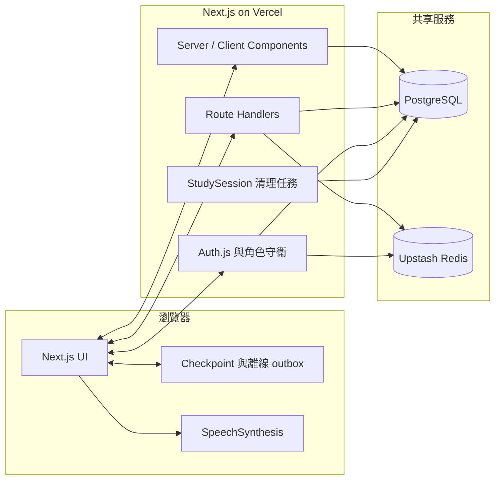

# 中學生英語單詞認讀學習平臺 · 項目計劃與現狀

> 科創比賽參賽項目
> 版本：v0.4（Retrieval-first V2 local product baseline）
> 創建日期：2026-07-19
> 更新日期：2026-08-18
> 狀態：Retrieval-first V2 本地產品基線已完成；production／pilot／research deferred

> 計劃書索引見 `plans/README.md`。本文內的程式及文件路徑均相對 repository root。

> 本文同時記錄產品願景、已實現能力和後續路線。代碼行為以測試與
> `prisma/schema.prisma` 為準；生產部署流程以 `DEPLOY.md` 為準。
> 當前學生流程及 AI 交接快照見
> [Retrieval-first V2 Current Product Baseline](./artifacts/retrieval-first-v2-current-product-baseline.md)。

---

## 一、項目概述

### 1.1 項目背景

初中階段英語詞彙學習存在三個長期痛點：

1. **死記硬背效率低**：學生普遍採用"背單詞表"方式，缺乏科學的複習節奏，遺忘率高。
2. **碎片時間難利用**：課間、通勤、排隊等 1–10 分鐘的碎片時間沒有順手的學習工具。
3. **學校場景仍有專門需求**：通用卡片工具自由度高，消費級背詞產品內容豐富，
   但本項目要驗證的是另一組約束——學校統一賬號、教師可見進度、透明算法、
   可審計事件，以及學生無需自行配置的 Retrieval-first 認讀流程。競品公開能力見第六節。

認知心理學與教育數據挖掘領域已有大量成熟研究（Ebbinghaus 遺忘曲線、SM-2、知識追蹤），但**這些成果在國內中學生可用產品中的嚴謹落地仍然稀缺**。

### 1.2 項目目標

構建一個**面向中學生、移動優先**的英語單詞**認讀**學習網站：

- **核心目標**：認字——看到英文能迅速反應出中文含義（不含拼寫/語法/聽說）。
- **算法核心**：基於 **SM-2 間隔重複算法**，科學安排每個單詞的複習時間。
- **體驗核心**：隨時隨地、可隨時中斷、下次自動續學。
- **學習核心**：先讓學生嘗試從記憶提取詞義，再揭示答案；self-rating 與客觀認讀證據分開。
- **交互核心**：Learning Card 需在非發音區域原地長按 3 秒揭示，揭示後報告與剛才所想
  是否一致；Objective Probe 的第一次合法答案才由服務器判分並推動間隔狀態。

### 1.3 項目意義

- 先把認知心理學與 SM-2 間隔重複實現成可運行、可測試的基線，再以真實學習事件
  評估 HLR、FSRS 或知識追蹤等後續模型。
- 移動優先設計，貼合中學生碎片化學習場景，降低堅持學習的門檻。
- 所有記憶調度邏輯嚴格遵循公開論文，**可復現、可評估、可對比**，具備科研價值。

---

## 二、目標用戶與使用場景

### 2.1 目標用戶

- **主要用戶**：初一至初三學生。
- **核心學習目標**：應對中考英語認讀，以 A1–B1 為核心範圍。
- **當前內容範圍**：倉庫詞表和產品級別已擴展至 A1–B2、5000+ 去重詞條；B2
  屬擴展內容，不應與“中考覈心詞彙數量”混為一談。

### 2.2 典型使用場景

- 課間、通勤、排隊、睡前等碎片時間。
- 單次學習時長 **1–10 分鐘**，隨時可中斷。
- 下次打開自動從上次位置繼續，無需任何"恢復"操作。

### 2.3 典型用戶故事

> 小明在公交車上打開網站。系統從 continuous stream 發出當前最合適的 Learning Card
> 或 Objective Probe，不要求完成固定題數。
>
> - 看到 `abandon`，他先在心裏想中文意思；約一秒後出現長按提示。他在非發音區域
>   原地長按三秒，卡片翻轉並顯示中文意思、音標位及發音，然後報告答案與剛才所想
>   是否一致。這個報告只用於記錄學習過程，不直接改變掌握度。
> - 稍後系統發出 Objective Probe；他第一次選擇答案後由服務器判分。答對／答錯分別
>   按 versioned policy 映射為 SM-2 quality 4／2，決定後續複習間隔。
>
> 5 分鐘後到站，他關閉頁面。下次打開，系統自動接着上次的進度繼續。

---

## 三、核心功能與實現狀態

| # | 功能 | 當前狀態 | 說明 |
|---|---|---|---|
| 1 | **統一發放學生賬號** | ✅ 已實現 | Seed 可選擇建立獨立臨時密碼的學生賬號；首次登錄強制改密，JWT 會話最長 30 天 |
| 2 | **Retrieval-first Learning Card** | ✅ 已實現 | 持續思考提示、延遲長按提示、3 秒 stationary long-press、揭示／翻卡及揭示後“一樣／不一樣”self-rating |
| 3 | **Objective Probe + SM-2 調度** | ✅ 已實現 | 首次客觀認讀答案由服務器判分，`retrieval-v1` 以 correct=4／wrong=2 推進 Review；self-rating 不直接評分 |
| 4 | **助記面板** | ⚠️ UI 已實現，內容待充實 | 支持音標、釋義、例句、圖片及近反義詞，但默認 seed 目前主要導入單詞、釋義、級別和分類 |
| 5 | **進度持久化與續學** | ✅ 已實現 | Continuous stream、Checkpoint、離線 outbox、stream-item credential、operationId 冪等、session／lease bounded recovery |
| 6 | **分級與單元闖關** | ✅ 已實現 | A1 / A2 / B1 / B2；按主題分類，達到 80% 認字率後順序解鎖 |
| 7 | **學習統計與留存** | ✅ 已實現 | 已解鎖範圍進度、A1–B2 明細、7 日柱狀圖／30 日熱力圖、連續打卡、成就及排行榜 |
| 8 | **教師端** | ✅ 已實現核心能力 | 班級概覽、學生分級進度與密碼重置；尚未提供任務佈置 |
| 9 | **管理端** | ✅ 已實現 | 用戶、角色、單詞庫及系統統計管理，並保護最後一名管理員 |
| 10 | **安全與審計** | ✅ 已實現 | Upstash 分佈式限流、session 撤銷、審計哈希、ReviewEvent ledger 與生產配置門禁 |
| 11 | **簡繁與主題** | ✅ 已實現 | opencc-js 簡繁切換及明暗主題 |
| 12 | **PWA** | ⏳ 未實現 | 尚無 web app manifest、service worker 或安裝流程 |
| 13 | **班級與名冊管理** | ✅ 已完成 local implementation／verification（external gates deferred） | Revision 3 已獲兩個相同全範圍 reviewer PASS；49 個 normal forward migrations、guarded reset／reseed、roster/auth/invariant suites、fresh 4-test disposable admin workflow（含 explicit rollover dispositions）、teacher canonical workspace／global reset、PII／migration contract checks 已驗證；production-only positive config、full-scale performance、完整原生 screen-reader／device matrix及deploy仍 deferred |

管理員用戶頁的 `PATCH /api/admin/users/[id]` 現在只接受明確的
`UPDATE_IDENTITY` 或 `CHANGE_STATUS` command：身份欄位使用 detail-query 的 User／Profile revision、近期重新驗證及
canonical identity validation；停權／恢復一律委派名冊 lifecycle service。密碼不再由 generic PATCH 處理，管理員／教師必須使用
各自 audience-bound 的 prepare→commit reset route；所有 callers 及測試均按此 contract，避免重複 status／credential writer。

### 3.1 Learning Card 揭示後的內容

- **音標 + TTS 發音**（瀏覽器內置 SpeechSynthesis，零成本）
- **中文釋義**（按詞性分條）
- **例句**（優先初高中難度）
- **助記圖片**（視覺聯想）
- **近義詞 / 反義詞**

> 當前數據邊界：組件和數據庫字段已支持上述內容，但 `prisma/seed.ts` 只從
> `word list.md` 自動導入 term、definition、level 與 category；音標、例句、圖片、
> 近義詞和反義詞需要經管理端或後續內容管線補充。因此“答案面已實現”不等於
> “全部 5000+ 詞均已有完整多模態素材”。

---

## 四、技術方案

### 4.1 記憶算法 —— SM-2

#### 論文依據

- **理論基礎**：
  - Ebbinghaus, H. (1885). *Memory: A contribution to experimental psychology*. —— 遺忘曲線奠基之作。
  - Cepeda, N. J., et al. (2008). *Spacing effects in learning: A temporal ridgeline of optimal retention*. **Psychological Science**. —— 綜合 254 項實驗，給出最佳複習間隔。
- **算法本體**：
  - Wozniak, P. (1994). *Optimization of learning: A new approach and computer application*. —— **SM-2 算法原始論文**。
  - Leitner, S. (1972). *So lernt man lernen*. —— Leitner System，SM-2 的概念前身。

> 截至 2026-08-10，[Anki 官方文檔](https://docs.ankiweb.net/deck-options.html#fsrs)
> 已把 FSRS 作為現代調度方案，並將 SM-2 稱為 legacy algorithm。因此本項目選擇
> SM-2 的理由應是實現透明、容易復現、適合 MVP 與研究基線，而不是
> “Anki 當前也使用 SM-2”。

#### 為什麼選 SM-2

| 候選 | 論文依據 | 實現難度 | 適合本項目？ |
|---|---|---|---|
| Leitner System | Leitner 1972 | 極低 | 創新性偏弱 |
| **SM-2** | **Wozniak 1994** | **低（公式現成）** | **✅ 當前可解釋基線** |
| FSRS | 開源可訓練調度器 | 中 | 收集足夠複習數據後評估 |
| Half-Life Regression | Settles 2016 (Duolingo) | 中（需訓練） | 未來工作 |
| BKT / DKT | Corbett 1995 / Piech 2015 | 高（概率圖/神經網絡） | 未來工作 |

#### 算法狀態（每詞一份）

```ts
interface ReviewState {
  easeFactor: number;      // 難度係數，初始 2.5
  interval: number;        // 當前間隔（天）
  repetitions: number;     // 連續答對次數
  nextReviewDate: Date;    // 下次到期日
  lastReviewedAt: Date | null;
}
```

#### V2 學習證據 → SM-2 quality 評級

| 事件 | 是否 scored | quality (0–5) | 含義 |
|---|---:|---:|---|
| Learning Card 揭示後的“一樣／不一樣”self-rating | 否 | 不適用 | 只記錄 operational encounter，不直接改變 Review／mastery |
| Objective Probe 第一次合法答案正確 | 是 | 4 | 客觀認讀成功，正常推進間隔 |
| Objective Probe 第一次合法答案錯誤 | 是 | 2 | 客觀認讀失敗，重置為短間隔並安排 remediation |
| Research-only diagnostic | 否 | 不適用 | 研究功能關閉；即使日後獲批亦無 operational 副作用 |

quality mapping 屬於 versioned `retrieval-v1` learning policy，不是永久不可改變的教育結論。
客戶端不能提交可信 quality、correctness 或正確答案；服務器按 immutable question snapshot 判分。

#### SM-2 更新公式（標準實現）

```ts
function updateSM2(state: ReviewState, quality: number): ReviewState {
  // quality: 0–5
  let { easeFactor, interval, repetitions } = state;

  if (quality < 3) {
    repetitions = 0;
    interval = 1;
  } else {
    if (repetitions === 0)      interval = 1;
    else if (repetitions === 1) interval = 6;
    else                        interval = Math.round(interval * easeFactor);
    repetitions += 1;
  }

  easeFactor = Math.max(
    1.3,
    easeFactor + (0.1 - (5 - quality) * (0.08 + (5 - quality) * 0.02))
  );

  const nextReviewDate = new Date();
  nextReviewDate.setDate(nextReviewDate.getDate() + interval);

  return { ...state, easeFactor, interval, repetitions, nextReviewDate,
           lastReviewedAt: new Date() };
}
```

### 4.2 技術棧

| 層 | 技術 | 說明 |
|---|---|---|
| 前端框架 | **Next.js 16.2 + React 19.2** | App Router、Route Handlers、Server / Client Components |
| UI | **Tailwind CSS v4 + Framer Motion 12** | 移動優先；Framer Motion 已成為字卡手勢的確定方案 |
| 數據庫 | **PostgreSQL** | 本地 Docker 與託管 PostgreSQL 使用同一套 schema |
| ORM | **Prisma 7 + `@prisma/adapter-pg`** | 生成 Client 至 `src/generated/prisma`，runtime 使用 `pg` pool |
| 認證 | **Auth.js v4 Credentials Provider** | 賬號密碼、JWT、角色守衞、首次改密及 tokenVersion 撤銷 |
| 分佈式限流 | **Upstash Redis** | Production 必填；涵蓋登錄、學習隊列、提交及憑證輪換 |
| 本地持久化 | **瀏覽器儲存** | Checkpoint 和離線評測 outbox；恢復時仍由服務端重新授權 |
| 測試 | **Node test + Playwright** | Pure policy／DB integration／migration／Chromium／Firefox／WebKit／mobile emulation；實際數量以當前 test output 與計劃 evidence 為準 |
| 部署 | **GitHub Actions + Vercel** | 先驗證與遷移數據庫，再部署同一 commit；是否已正式上線須由部署記錄確認 |

### 4.3 系統架構



當前 runtime 不會查詢 ECDICT、Free Dictionary API 或 Unsplash。詞表內容由 seed
預先寫入 PostgreSQL，應用請求只訪問本項目數據庫和限流服務。

### 4.4 數據模型（Prisma）

為避免計劃書中的複製版 schema 再次落後，完整字段只在
`prisma/schema.prisma` 維護。當前模型職責如下：

| 模型 | 職責 |
|---|---|
| `User` | 賬號、bcrypt 密碼、角色、tokenVersion、首次改密狀態及各類關聯 |
| `Word` | 單詞、釋義、A1–B2 級別、分類及可選助記素材 |
| `Review` | 每位用戶每個單詞的當前 SM-2 狀態 |
| `ReviewEvent` | V1／V2 scored ledger、詞條快照、event kind、objective provenance 及成就解鎖結果 |
| `StudySession` | 服務端簽發的 V1／V2 flow-pinned session、到期時間、退休狀態及原子輪換鍵 |
| `StudySessionItem` | 保留作 V1 compatibility／rollback 的 legacy 逐詞 nonce item |
| `StudyStreamItem` | V2 canonical stream item、typed action、lease、credential digest lineage 及完成狀態 |
| `EvidenceObligation` | 有上限／期限的日後 objective verification 工作 |
| `ObjectiveEvidenceTarget` | 單一 scored evidence target、expected Review revision 及 authoritative result |
| `ObjectiveQuestionSnapshot` | Immutable option／answer snapshot，供 server scoring、retry 及 dispute audit |
| `StudyEncounter` | Learning Card reveal／self-rating 等 operational encounter 記錄 |
| `OperationReceipt` | 全局 `(userId, operationId)` 冪等結果及 authoritative response |
| `SecurityEvent` | 密碼、角色、用戶及 session 撤銷等安全審計事件 |
| `DatabaseMetadata` | 數據庫環境分類及 seed 安全標記 |
| `StudyDay` | 以 Asia/Shanghai 日曆日記錄的冪等打卡 |
| `UserAchievement` | 用戶已解鎖的成就 key 與時間 |

枚舉包括 `Level`（A1 / A2 / B1 / B2）、`Role`（STUDENT / TEACHER /
ADMIN）、`ReviewEventKind` 與 `SecurityEventType`。

### 4.5 助記素材來源

| 素材 | 當前來源 | 當前狀態 |
|---|---|---|
| 單詞、中文釋義、級別、主題 | 倉庫內 `word list.md` | Seed 已自動解析；同詞重複時保留最低級別 |
| 音標、詞性 | 管理端 / 後續內容管線 | Schema 與 UI 支持，seed 未自動填充 |
| 例句 | 管理端 / 後續內容管線 | Schema 與 UI 支持，當前沒有 Free Dictionary runtime 調用 |
| 近義詞 / 反義詞 | 管理端 / 後續內容管線 | 新詞 seed 時寫入空數組 |
| 助記圖片 | 管理端填寫 URL / 後續內容管線 | 當前沒有 Unsplash runtime 調用 |
| 發音 | 瀏覽器 `SpeechSynthesis` API | 零成本，無需音頻文件 |

ECDICT、受許可詞典或圖片服務仍可作為未來的離線內容構建來源，但必須先處理授權、
字段映射、內容審核與可重複構建；不能在本文中寫成已經存在的線上依賴。

### 4.6 遷移歷史與正確指令

#### 當前遷移歷史

| 範圍 | 數量 | 作用 |
|---|---:|---|
| 2026-07-24 至 2026-07-28 | 5 | 初始模型、角色、tokenVersion、首次改密及 B2；`add_user_role` 保留為歷史 NO-OP |
| 2026-08-02 | 2 | StudyDay 與 UserAchievement |
| 2026-08-08 | 6 | ReviewEvent ledger、審計快照、事件種類、提交 session 與 legacy normalization |
| 2026-08-09 | 4 | StudySession / security 加固、管理員與學習 provenance、審計 subject 重建與清理 |
| 2026-08-10 | 1 | StudySession 原子 rotation |
| 2026-08-11 | 1 | Study credential lineage |
| 2026-08-12 | 5 | Retrieval stream V2、encounter feedback／reveal、stream-work linkage 及 credential lineage |
| `prisma/contract-migrations/` | 2 | Legacy review bridge 的獨立 contract 階段 |

合計為 **24 個一般 migrations + 2 個 contract migrations**。具體順序和 SQL 以
`prisma/migrations/`、`prisma/contract-migrations/` 及 checksum 腳本為準；不要在
計劃書維護另一份逐文件複製清單。

#### 正確指令（新環境部署）

```bash
# 1. 生成 Prisma Client
npx prisma generate

# 2. 執行 checksum 與 production-safety preflight 後套用一般 migrations
npm run db:deploy

# 3. 在確認數據庫環境與 INITIAL_ADMIN_PASSWORD 後導入詞表及賬號
npm run seed
```

- 不要用 `prisma db push` 建表；所有 schema 變更均須新增 migration。
- `DATABASE_URL` 供 runtime 使用；託管環境通常是 transaction pooler 6543，並可帶
  `?pgbouncer=true`。
- `MIGRATE_URL` 只供 migration / seed，使用 direct connection 或 session pooler
  5432，**不要**加 `pgbouncer=true`，也不會回退到 `DATABASE_URL`。
- `npm run db:contract` 會移除 legacy bridge，只可在舊 writers 全部下線、檢查窗口
  通過並獲得明確確認後獨立執行。
- Production 發佈必須遵循 `.github/workflows/deploy-production.yml`：先驗證、遷移，
  再讓 Vercel 部署同一 checkout。完整說明見 `DEPLOY.md`。

---

## 五、創新點

1. **可解釋、可復現的學習基線**
   當前調度公式、objective first response 到 versioned quality 的映射和測試均公開，適合作為比賽研究的
   可復現基線；未來可用同一事件數據與 FSRS / HLR 做可量化對照。

2. **Retrieval-first 與客觀證據分層**
   Learning Card 先提供回想機會，再以 3 秒 stationary long-press 揭示；揭示後的 self-rating
   不冒充客觀成績。Objective Probe 的第一次答案才形成 scored evidence，貼合**認讀**這一具體目標。

3. **移動優先且可恢復的學習流程**
   單次學習無最小時長限制；checkpoint 與離線 outbox 支持中斷恢復，而服務端
   stream-item credential、operation receipt 和 operationId 保證恢復與重試不會重複推進 SM-2。

4. **面向學校場景的安全與可審計性**
   統一賬號、角色權限、首次改密、分佈式限流、安全事件及逐次 ReviewEvent ledger
   讓教師管理、實驗複核和故障追蹤擁有同一份數據依據。

5. **從產品事件直接走向研究評估**
   V2 ReviewEvent 保存有 provenance 的 objective result、quality、級別、時間和冪等標識，
   可支持後續留存、客觀認讀率及算法對照；research telemetry 目前關閉，正式研究必須另行
   完成倫理、家長 permission、學生 assent、retention 及 protocol gate。

---

## 六、產品定位與公開競品基準

以下比較只採用截至 **2026-08-10** 可從官方頁面確認的產品定位；沒有公開證據的
調度算法、效果或市場優劣不作推斷。

| 產品 | 官方可確認的重點 | 與本項目的主要差異 |
|---|---|---|
| Anki | 跨設備同步、媒體卡片、自定義牌組與間隔複習；現代版本提供 FSRS，並保留 legacy SM-2 | 通用型、自由度高；本項目聚焦校內統一賬號、初中詞表、Retrieval-first 客觀認讀及教師管理 |
| 百詞斬 | 考試詞表、圖像與場景記憶、例句、發音和多種內容形態 | 內容資產成熟；本項目強調公開可復現調度、學校角色及可審計學習事件 |
| 墨墨背單詞 | 根據學習數據分析遺忘曲線與記憶持久度，提供複習規劃、解釋、例句和助記 | 個性化內容和複習規劃成熟；本項目當前更偏學校自管、Web 輕量流程與透明基線 |
| **本項目** | A1–B2 分級單元、Retrieval-first continuous stream、Objective Probe、SM-2、斷點續學、教師／管理端和安全審計 | 優勢是學習證據分層、範圍清晰與全棧可控；短板是多模態內容覆蓋、真實學生驗證及 PWA 尚未完成 |

官方核對來源：[Anki 官網](https://apps.ankiweb.net/)、
[Anki 調度說明](https://docs.ankiweb.net/deck-options.html#fsrs)、
[百詞斬官網](https://www.baicizhan.com/)、
[墨墨產品與服務協議](https://www.maimemo.com/terms)。提交比賽材料前應再次檢查日期與
頁面內容。

---

## 七、開發里程碑與下一步

| 階段 | 狀態 | 已有產出 | 下一驗收點 |
|---|---|---|---|
| **P0 基礎詞表** | ✅ 已完成 | `word list.md`、A1–B2 分類及冪等 seed | 把內容完整度另列為 P7，不再假定 ECDICT 管線已存在 |
| **P1 數據層** | ✅ 已完成 | PostgreSQL、Prisma schema、48 個 normal migrations 及新庫 replay 檢查 | 所有後續 schema 變更繼續走 expand / contract 流程 |
| **P2 認證與角色** | ✅ 已完成 | Auth.js、學生／教師／管理員、首次改密、撤銷與限流 | 完成 production secrets 和真實部署驗收 |
| **P3 學習核心** | ✅ 本地基線完成 | Retrieval-first continuous stream、3 秒 long-press Learning Card、Objective Probe、versioned SM-2 evidence policy、單元模式 | 實體 iPhone Safari／Android Chrome 與完整 screen-reader acceptance 屬 external gate |
| **P4 可靠續學** | ✅ 本地基線完成 | Checkpoint、離線 outbox、stream-item credential、session／lease recovery、冪等 ledger、V1 rollback | Production observation 及 threshold decision 未獲授權 |
| **P5 統計與後臺** | ✅ 已完成 | 統計、打卡、成就、排行榜、教師端及管理端 | 核對統計定義並加入比賽評估指標 |
| **P6 發佈準備** | 🟡 外部 gate deferred | Responsive UI、跨瀏覽器迴歸、production workflow、部署文件及 local rollback 已有 | 正式域名、secrets、production migration／deploy、監控、備份及 observation 需另行授權 |
| **P7 內容完善及詞庫治理** | 🟡 local implementation／verification及full-size效能加固完成，production readiness待續 | 已建立 39 欄 [`word-catalog-v1` 團隊編寫標準](./artifacts/word-catalog-authoring-standard-v1.md)及[詞庫生命週期實施計劃](./word-catalog-governance-and-lifecycle.md)；Objective Probe 題幹由 `term`／`definition_zh` 衍生，並使用分方向人工干擾池。現已完成 sense-level catalog、digest／set-digest 鎖定的 5,469 ACTIVE／107 DRAFT 正式 baseline、學生學習／統計 current reader、V1 compatibility projection、管理員／老師完整檢視與篩選、逐條及CSV批量草稿提交、衝突處理、capability批次審核／原子套用、修改歷史、修正批次、老師意見／待辦、sense-aware真實題目預覽、review dialog freshness、全 `NO_CHANGE` retry一次性closure及catalog limiter；本機5,000 history／200-row lifecycle／100個同步學生讀取基線、compact mutation response及preview批量SQL加固已完成，200次review傳輸由165.26 MiB降至0.70 MiB，preview p95由2.41–2.59秒降至176.76–183.13 ms | 進行staging／Vercel性能驗證、代表性老師UAT及完整a11y／裝置矩陣；另行批准production migration／deploy、scheduler及最終legacy cleanup |
| **P8 PWA** | ⏳ 待開始 | 尚無實現 | Manifest、icons、service worker、更新策略及安裝／離線驗收 |
| **P9 真實用戶研究** | ⏸ 暫緩／功能關閉 | Operational objective ledger 已有；沒有 research telemetry／assignment | 倫理／學校審批、家長 permission、學生 assent、protocol 獲批前不得開始 |
| **P10 教師任務** | ⏳ 待開始 | 已有教師角色、班級統計與學生詳情 | 周任務佈置、截止時間、完成狀態及班級彙總 |
| **P11 班級與名冊** | ✅ 已完成 local implementation／verification（external gates deferred） | Revision 3 已獲 Hume 與 Bernoulli 對相同 contract 全文 PASS；local canonical schema、49 個 normal forward migrations、guarded reset／reseed、auth／班級權限／名冊流程、teacher workspace／global reset、fresh 4-test disposable admin workflow、PII／migration contract checks 已驗證；production-only positive config、full-scale performance、完整原生 screen-reader／device matrix及deploy deferred | 補足需另行授權的 production／native-device release gates；之後另行審批 production migration、backup、deploy 及 observation |

### 7.1 Retrieval-first Learning Stream v2（2026-08-15 current baseline）

本節後半保留 2026-08-12 至 2026-08-14 嘅 implementation chronology 作歷史證據；當前
產品行為以 [Current Product Baseline](./artifacts/retrieval-first-v2-current-product-baseline.md)、
已批准 Contract 同程式／測試為準。尤其唔可以由歷史 I-011 tap-to-reveal 描述覆蓋其後
I-012／Contract C-011 已批准嘅 stationary long-press 3 秒 reveal。

已完成 internal／test scope 的 operational handoff，並補上 local product-complete assignment：
production V2 仍以 server assignment deny-by-default／allowlist 開啟，local development 可用
明確 `STUDY_V2_ASSIGNMENT_MODE=all` 驗證完整 V2，session pin `flowVersion`，V1 仍保留作
rollback。V2 具備 continuous global／bounded unit
stream、Learning Card reveal gate、Objective Probe immutable snapshot、server scoring、
Evidence Obligation cap／delay／expiry、StudyEncounter、item credential、global
OperationReceipt、outbox／checkpoint 及 legacy metrics 分欄。self-rating 不直接更新
Review／mastery；objective recognition 才產生帶 provenance 的 V2 ReviewEvent。新增
credential compatibility inventory、bounded internal soak、request-level structured
observability 及 support／incident runbook；本地 inventory 顯示 0 receipt／provenance／
lineage gap。

Production shared rate-limit backend guards 已同步涵蓋 login、password change、study queue、
study action 及 credential renewal：正式 runtime 缺少 Upstash 時 fail closed，明確 browser-test
runtime 纔可使用 local fallback；production build 同完整 browser regression 已重新驗證。

本地 feature-off rollback smoke 已完成；正式 production deploy、學生 pilot、研究
telemetry／consent 及 contract cleanup 尚未執行。後者仍是
`plans/retrieval-first-learning-program.md` 及其受控子計劃的外部 gates。

2026-08-13 local product-complete evidence 已補齊：local all-user V2 Playwright regression
3/3 passed，覆蓋 V2 assignment、resume feedback ACK、Objective Probe、Learning Card reveal
gate 及 self-rating；`STUDY_V2_ASSIGNMENT_MODE=off` V1 rollback、production configuration
reject-all guard、DB／migration／build／unit／lint／typecheck 亦通過。production、pilot、
research 及 destructive contract cleanup 按 scope 保持 deferred。

其後使用者 visual review 開出同一 V2 scope 內嘅 I-011 UI correction：當時先建立卡面 reveal
（排除發音 control）及 one-way flip，self-rating actions 移到卡下並與卡片同寬，學生帳戶
名稱於繁體 locale 顯示繁體字。2026-08-13 已實作並驗證：`npm run test:e2e:study-stream-v2`
4/4 passed（包括中文答案／例句、背面發音、同寬 rating actions 及 zh-Hant／zh-Hans display），
V1 feature-off student IA／QA 及完整 card-motion／study integration regression 亦通過；不涉及
learning、evidence 或資料庫 contract。I-011 嘅 tap presentation 隨即由下一段 I-012 long-press
correction 取代；production deploy、學生 pilot、研究 telemetry／consent 及 destructive contract
cleanup 仍按 scope deferred。

2026-08-13 其後新增並完成 I-012 interaction correction：學生先看到並保留思考提示，約 1 秒後追加
長按 3 秒揭示答案，揭示前唔接受即時 tap，揭示後左右掃改用「和剛纔想的一樣／不一樣」語義。已通過
`npm run test:e2e:study-stream-v2`（4/4）、V1 feature-off student IA／QA 及完整 card-motion／study
integration regression；不涉及 learning、evidence 或資料庫 contract。production deploy、學生 pilot、
研究 telemetry／consent 及 destructive contract cleanup 仍按 scope deferred。

2026-08-13 再新增並完成 I-012 visual feedback refinement：兩段 retrieval 提示以呼吸式高亮呈現，
按住時在按下位置顯示透明圓圈，隨 3 秒進度越來越快／明顯；中途放手、移動或 pointer cancel 會重置
計時。V2 E2E、完整 card-motion、V1 IA／QA 及 reduced-motion visual smoke 已通過；不涉及 learning、
evidence、migration 或 server contract。

2026-08-13 再新增並完成 I-013 session-expiry recovery／system locale correction：普通 V2 action
仍對 expired／revoked session fail-closed；明確 recovery route 以同一 item credential、typed
operation 及 Serializable transaction 恢復未撤銷 expired session，保留 operationId／outbox 並
對 duplicate replay 回 authoritative result，recovery 失敗唔會無限重試。V2 assignment／stream
loading copy 改由 canonical 簡體經 `tc()` 顯示。`npm run test:db:stream-v2` passed，
`npm run test:e2e:study-stream-v2` 6/6 passed，`STUDY_V2_ASSIGNMENT_MODE=off npm run
test:e2e:card-motion` Chromium 73 passed／4 skipped、WebKit 33 passed；build／unit／lint／typecheck
亦通過。無 schema／migration 改動，未執行 contract migration、production deploy、學生 pilot 或
research collection；以上 external gates 仍 deferred。

2026-08-13 local smoke 再發現 I-013 未覆蓋 item credential／lease 過期及 refresh 輪換後嘅
合法 predecessor，令 V2 Objective Probe 嘅 durable outbox action 仍會顯示「學習項目憑證無效或已過期」。
已按 I-014 完成 follow-up：normal action 繼續 fail-closed，explicit recovery 只接受 matching
bounded server lineage，保留原 operationId／outbox，並對 expired lease 做 transaction 內 CAS
恢復。`npm run test:db:stream-v2`、`npm run test:e2e:study-stream-v2` 6/6、
`STUDY_V2_ASSIGNMENT_MODE=off npm run test:e2e:card-motion`（primary 73 passed／4 skipped、
WebKit 33 passed）及 build／unit／lint／typecheck 均通過。無 schema／migration 改動，未執行
contract migration、production deploy、學生 pilot 或 research collection；以上 external gates 仍 deferred。

2026-08-13 已完成 I-015 retrieval prompt presentation refinement：移除 V2「可隨時離開，進度會安全保留」
說明，將「長按 3 秒揭示答案」放到發音 button 下方，降低兩段提示嘅閃動／呼吸幅度，並將 secondary
prompt 改為漸進式出現。`npm run test:e2e:study-stream-v2` 6/6、`STUDY_V2_ASSIGNMENT_MODE=off
npm run test:e2e:card-motion` primary 73 passed／4 skipped、WebKit 33 passed，並通過 build／unit／
lint／typecheck。只涉及 V2 UI presentation，唔涉及 migration、production deploy、學生 pilot 或
research collection；以上 external gates 仍 deferred。

2026-08-15 文件結案確認：其後 I-016–I-035 已完成 EMM study surface、choice card、revealed
Learning Card、Objective feedback／continuation、swipe badge、CI ledger bridge、metadata alignment、
首頁／統計進度、活動圖、tablet／desktop responsive、返回掣同 reward icon system 等修正。
呢啲全部已記錄於 Program／Implementation evidence，並濃縮到 Current Product Baseline。
Retrieval-first V2 因此視為本分支已完成嘅 local product baseline；唔代表已合併 `main`、
production deploy、真實學生 pilot、research collection 或 Stage E destructive cleanup。

---

## 八、參考文獻

1. Ebbinghaus, H. (1885). *Memory: A contribution to experimental psychology*. New York: Teachers College, Columbia University.
2. Leitner, S. (1972). *So lernt man lernen: Der Weg zum Erfolg*. Freiburg: Herder.
3. Wozniak, P. (1994). *Optimization of learning: A new approach and computer application*. University of Technology in Poznan. **(SM-2 原始論文)**
4. Cepeda, N. J., Pashler, H., Vul, E., Wixted, J. T., & Rohrer, D. (2008). *Spacing effects in learning: A temporal ridgeline of optimal retention*. **Psychological Science**, 19(11), 1095–1102.
5. Corbett, A. T., & Anderson, J. R. (1995). *Knowledge tracing: Modeling the acquisition of procedural knowledge*. **User Modeling and User-Adapted Interaction**, 4(4), 253–268.
6. Piech, C., Bassen, J., Huang, J., Ganguli, S., Sahami, M., Guibas, L. J., & Sohl-Dickstein, J. (2015). *Deep knowledge tracing*. **Advances in Neural Information Processing Systems (NeurIPS)**, 28.
7. Settles, B., & Meeder, B. (2016). *A trainable spaced repetition model for language learning*. **Proceedings of ACL 2016**, 1848–1858. **(Duolingo Half-Life Regression)**

---

## 九、未來工作（比賽論文中的創新展望）

1. **FSRS / Half-Life Regression 對照**
   收集足夠真實答題數據後，在固定評估指標下比較當前 SM-2、FSRS 與 HLR；只有在
   留出數據上證明改善，才考慮替換生產調度，避免以算法名稱代替實證。

2. **Bayesian / Deep Knowledge Tracing**
   引入 BKT（Corbett 1995）或 DKT（Piech 2015），建模"學習者已掌握該詞"的概率分佈，從"調度複習"升級為"掌握度診斷 + 個性化推薦"。

3. **擴展學習模式**
   - 聽寫模式（TTS → 學生輸入）
   - 拼寫模式（看中文 → 學生輸入）
   - 當前 MVP 聚焦**認讀**，其他模式作為路線圖。

4. **教師任務系統**
   教師查看班級與學生進度已經實現；下一步是佈置周任務、設定範圍與截止時間、
   跟蹤完成狀態，併為學生提供清晰的待辦入口。

5. **合規內容管線**
   為音標、例句、近反義詞和圖片建立有授權、可重複構建、可人工抽檢的 enrichment
   流程，並持續報告每個級別的字段覆蓋率與錯誤率。

---

## 附錄 A：2026-08-10 歷史代碼審查快照

本附錄只保存當日審查歷史，不能覆蓋 2026-08-15 Retrieval-first V2 Current Product Baseline。

- ✅ Next.js 16.2、React 19.2、Tailwind v4、Framer Motion 12 與 Prisma 7
- ✅ PostgreSQL runtime / migration 憑證分離，以及 serverless pool 上限
- ✅ 當時審查記錄為 10 個 Prisma models、18 個一般 migrations；當前為 16 個 models、
  24 個一般 migrations及 2 個 contract migrations，具體仍以 schema／目錄為準
- ✅ A1 / A2 / B1 / B2 詞表解析、最低級別去重與冪等 upsert
- ✅ Auth.js Credentials、三種角色、首次改密、session 撤銷與最後管理員保護
- ✅ Upstash production 限流門禁、安全審計哈希與 production config 檢查
- ✅ 當時已有 SM-2、滑動字卡、單元解鎖、checkpoint、離線 outbox、study session / nonce
- ✅ ReviewEvent 冪等 ledger、Serializable transaction 與衝突重試
- ✅ 打卡、統計、9 項成就、排行榜、教師端、管理端、簡繁及明暗主題
- ✅ 當時已有 67 個 Node 單元測試及 Playwright 跨瀏覽器 workflow；當前數量以 test output 為準
- ✅ `DEPLOY.md`、Docker Compose、migration safety checks 與 gated production workflow
- 🟡 助記面板字段和 UI 已有，但豐富內容覆蓋尚未完成
- 🟡 發佈自動化已存在，但正式域名、production secrets、數據庫狀態及線上部署結果
  必須從外部平臺核實，不能由倉庫靜態文件推斷
- ⏳ PWA、實體移動設備驗收、真實學生研究、教師任務和算法對照尚未完成

## 附錄 B：2026-08-15 當前交接摘要

- ✅ Retrieval-first V2 local all-user mode、continuous global／bounded unit stream 已完成；
- ✅ Learning Card 採用持續思考提示、延遲 secondary hint、3 秒 stationary long-press reveal、
  flip answer 及揭示後一樣／不一樣 self-rating；
- ✅ Objective Probe first response 由服務器評分，correct=4／wrong=2；self-rating 不改 mastery；
- ✅ Credential v2 expand／dual-flow、offline／cross-device／resume、V1 feature-off rollback 已驗證；
- ✅ I-011–I-035 final UI／responsive／stats／reward icon corrections 已完成；
- ⏸ Production、pilot、research、原生完整 accessibility matrix 及 destructive cleanup deferred。
